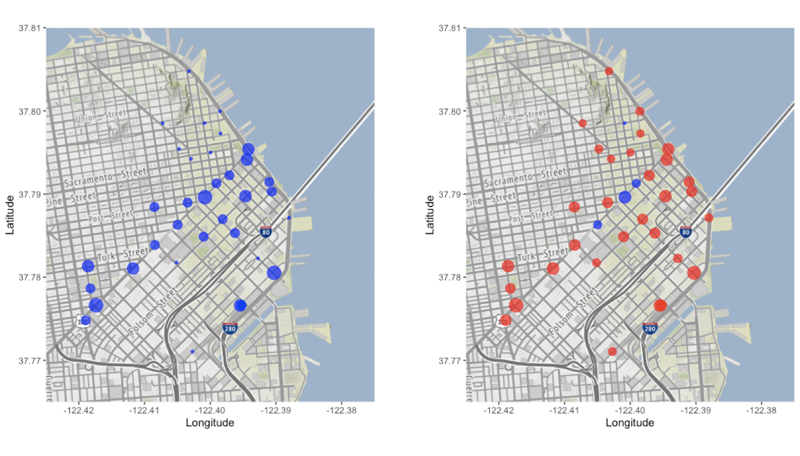

# San Francisco Bike Sharing Dock Allocation

Using Machine Learning and Optimization to reallocate the docks across 70 bike sharing station in SF Bay Area. This project was completed as part of an MIT class.

**Data**

The dataset for this project is publicly available here: https://www.kaggle.com/benhamner/sf-bay-area-bike-share

**Method**

The analysis is split in two steps:
- **Predict** the demand for the next month using Optimal Regression Trees (Bertsimas et al., 2017). This results in the following tree (truncated for demonstrative purposes). 

- **Optimize** the dock allocation to minimize the number of days with low stock of free docks using a Mixed Integer Optimization (MIO) formulation. The program is optimized to solve in under 3 seconds. This results in the following suggested changes to the dock allocation in downtown SF. On the left is the old allocation, on the right in red - changes number of docks at stations, in blue - unchanged. The size of the circles corresponds to the number of docks. 

**Languages**

The data is cleaning in done in **R**. The predictive model as well as the optimization is done in **Julia** with Gurobi as the solver.
